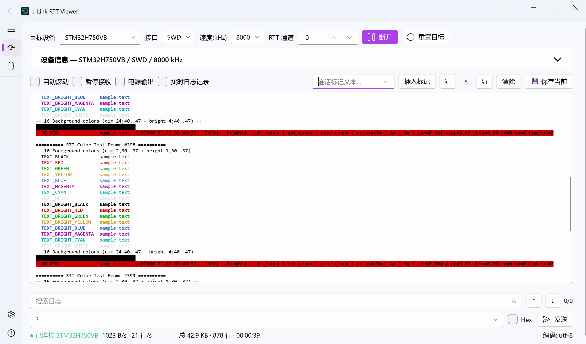
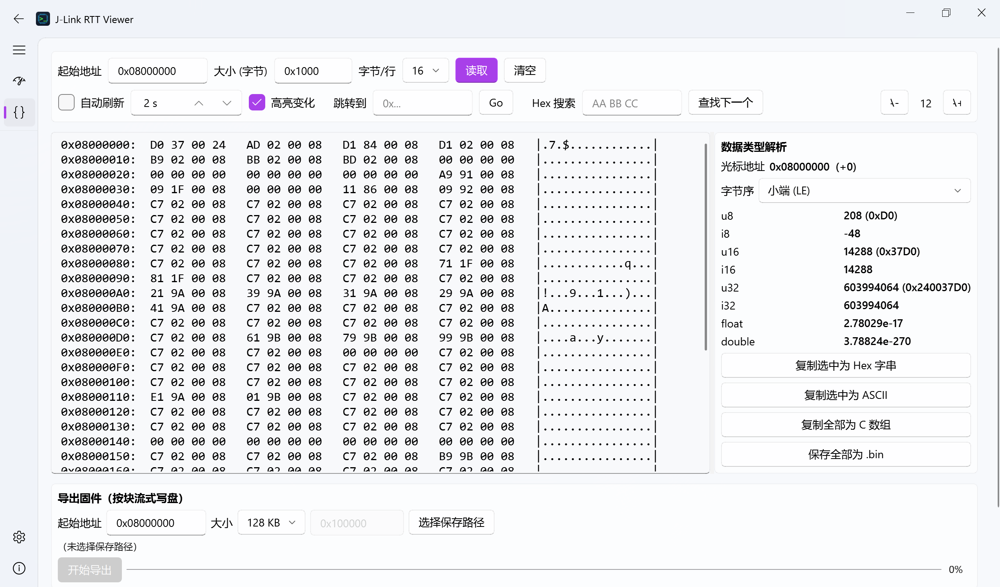
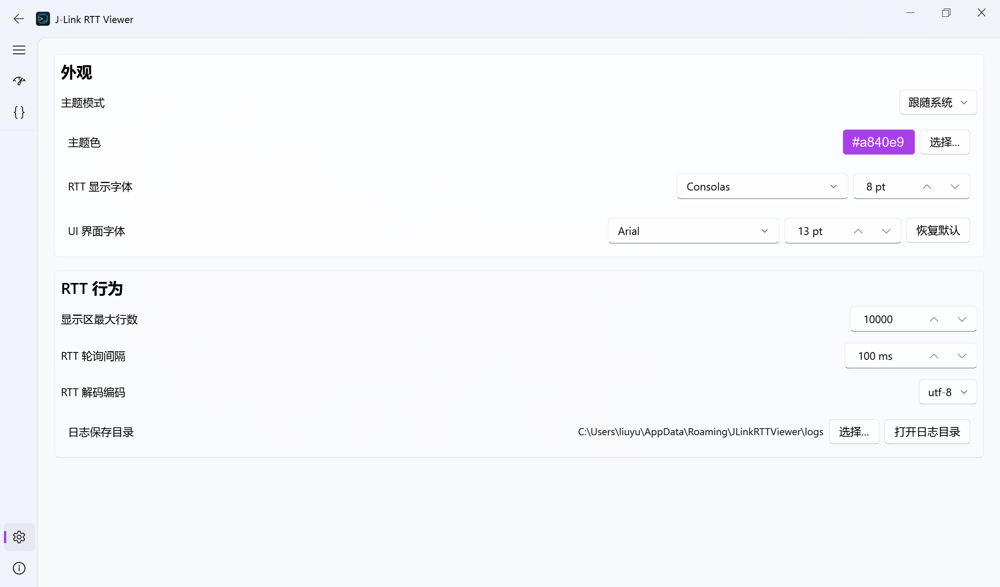
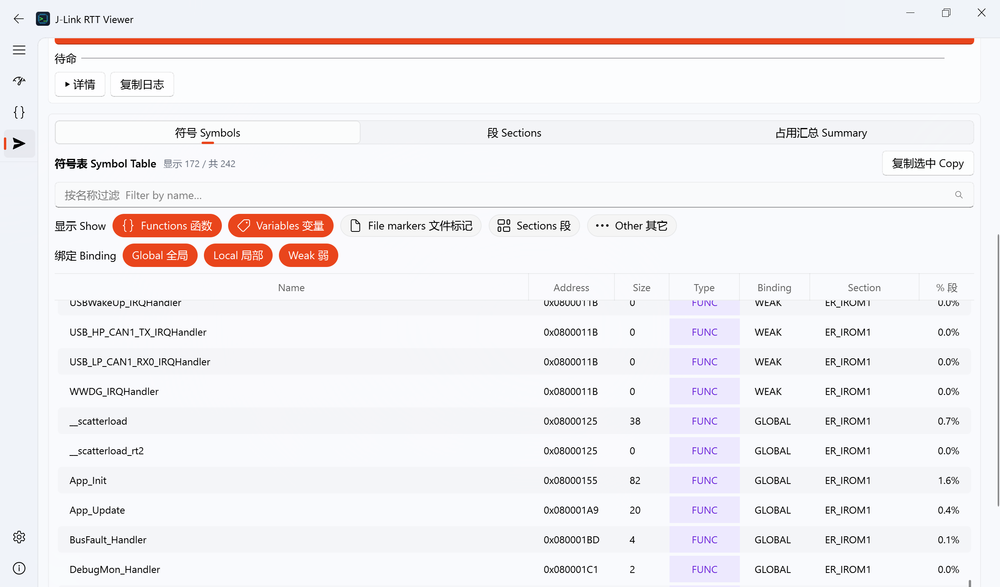

# J-Link RTT Viewer (PyQt)

> Fluent 风格的 SEGGER J-Link RTT 实时查看 + MCU 内存读写工具，PySide6 + qfluentwidgets 重写版。

[](https://github.com/MisakaMikoto128/j-link-rtt-viewer-pyqt/actions/workflows/test.yml)
[](LICENSE)
[](https://www.python.org/)
[](https://github.com/Square/pylink)



## ✨ 功能

- 🚀 **实时 RTT 监控** — UTF-8 / GBK / UTF-16-LE / Latin-1 / ASCII 解码，ANSI 颜色着色，0-15 通道任意切换，文本 / 十六进制回发数据，最近 50 条发送历史
- 🔍 **搜索 / 替换浮动栏** — Ctrl+F 查找 / Ctrl+H 替换，支持正则 / 全词 / 大小写，匹配高亮 + 染色替换，VSCode 风格交互
- 🔢 **HEX 显示 / 发送** — 接收区一键切十六进制查看，发送区支持 HEX 模式双向切换，发送历史自动记录
- ⏱️ **定时发送** — 按间隔自动重复发送，支持文本 / HEX 两种模式
- 🧮 **CRC 发送脚本** — 内置 CRC-8 / CRC-16 / CRC-32 算法，发送时自动追加校验值，可开关
- 📏 **自动断帧** — 按空闲间隙自动插入换行，无需 MCU 端配合即可分行显示
- 💾 **固件烧录** — 支持 `.axf` / `.elf` / `.hex` / `.bin`，浏览 / 拖放 / 最近文件三种选法，独立 worker（不干涉 RTT 会话），可选擦除模式与完成动作，可选逐字节校验，详情日志一键复制（[指南](docs/flashing-guide.md)）
- 🔁 **固件格式转换** — 「另存为」一键把 axf/elf/hex/bin 转换为 `.bin` / `.hex`，离线可用，无需 J-Link
- 🔣 **符号表查看器** — 选中 axf/elf 直接读 `.symtab`：名称搜索、地址/大小数值排序、类别 + 绑定 chip 多选过滤、彩色 Type pill、复制选中（[指南](docs/symbol-table-guide.md)）
- 🔍 **内存查看** — Hex dump（8/16/32 字节/行），地址跳转，hex pattern 搜索，自动刷新 + diff 高亮，hover 实时类型解析（u8-u64 / i8-i64 / float / double，小端/大端），固件按区间分块导出 `.bin`，写内存（带 confirm）
- 📐 **收窄模式悬浮面板** — 窗口缩窄时左侧配置面板自动转为悬浮卡片，ToolToggleButton 控制显隐，fade + slide 动画，不遮挡工具栏
- 🎨 **Fluent 设计** — 浅色 / 深色 / 跟随系统主题，主题色 + RTT 字体 + UI 字体可独立配置
- 📝 **会话标记** — 手动插入 + 连接/断开自动插入（颜色可配）
- ⌨️ **快捷键** — F2 连接 / F3 断开 / F4 重置 / Ctrl+F 查找 / Ctrl+H 替换（任意子页生效，幂等）
- 🔄 **可配置重置行为** — 正常重置 / 重置并暂停（halt）/ 自动重连（更可靠，1s 延迟）
- 📐 **可拖动 RTT display 高度** — 自定义 resize handle，超出窗口自动整页滚
- 📦 **Nuitka 单 exe 打包** — 多分辨率图标，开发/打包一致

## 📸 截图

| RTT 监控 | 内存查看 | 设置 |
|:---:|:---:|:---:|
|  |  |  |

| 固件烧录 | 符号表查看器 |
|:---:|:---:|
|  |  |

## 🚀 快速开始

### 前置要求

- **SEGGER J-Link 驱动**（[官方下载](https://www.segger.com/downloads/jlink/)），`JLinkARM.dll` 由 pylink 自带
- 一根 J-Link 调试器（J-Link BASE / EDU / PLUS 等，或 Flasher 设备）
- 从源码运行还需要 **Python 3.10+**；下载 Release 直接用则不需要

### 直接下载使用（推荐）

到 [Releases 页面](https://github.com/MisakaMikoto128/j-link-rtt-viewer-pyqt/releases) 下载，两种包二选一：

| 包名 | 适合 | 启动速度 | 体积 |
|---|---|---|---|
| `JLinkRTTViewer-vX.Y.Z-win64.zip` | 装到固定目录长期用 | 最快（无解压步骤） | ~43 MB（解压后 ~107 MB） |
| `JLinkRTTViewer-vX.Y.Z-win64.exe` | U 盘 / 临时使用 / 单文件分发 | 首次 ~5s（解压到缓存），后续接近 zip 版 | ~31 MB |

**使用步骤：**
1. zip 版：解压到任意目录后双击 `JLinkRTTViewer.exe`；onefile 版：直接双击 .exe
2. 在 UI 顶部选目标 MCU、接口（SWD / JTAG）、速度、RTT 通道 → 点「连接」
3. 用户偏好自动保存到 `%APPDATA%\JLinkRTTViewer\user_prefs.json`
4. 想加自己的 MCU / 改默认速度档？编辑 `%APPDATA%\JLinkRTTViewer\config.json`（首次启动自动从内置版 seed 一份）

> 不需要安装 Python，**目标机器只要装了 SEGGER J-Link 驱动就能跑**。
> onefile 版首次启动会解压到 `%LOCALAPPDATA%\JLinkRTTViewer\Cache\<版本号>\`，删除该目录会触发下次启动重新解压。

更多用法见 [用户手册](docs/USER_GUIDE.md)。

### 从源码运行

```bash
# 1. 克隆
git clone https://github.com/MisakaMikoto128/j-link-rtt-viewer-pyqt.git
cd j-link-rtt-viewer-pyqt

# 2. 创建虚拟环境
python -m venv venv
venv\Scripts\activate.bat

# 3. 安装依赖（pylink-square 锁定 1.6.0，详见下方）
pip install -r requirements.txt

# 4. 启动
python src/main.py
# 或直接双击 start.bat
```

### 打包

两个 bat 二选一：

```bash
build_nuitka.bat            # standalone：输出 build/main.dist/，启动最快
build_nuitka_onefile.bat    # onefile：输出 build/onefile/JLinkRTTViewer.exe，单文件便携
```

打 Release 资产：

```powershell
./scripts/package_release.ps1 -Mode both
# 产物：
#   build/JLinkRTTViewer-vX.Y.Z-win64.zip  （standalone 压缩包）
#   build/JLinkRTTViewer-vX.Y.Z-win64.exe  （重命名后的 onefile）
```

均**不需要目标机器装 Python**。

## 📖 文档

- **用户手册**：[docs/USER_GUIDE.md](docs/USER_GUIDE.md) — 完整 UI / 配置 / 快捷键说明
- **固件烧录指南**：[docs/flashing-guide.md](docs/flashing-guide.md) — 烧录流程 + 固件另存为（格式转换）
- **符号表查看器指南**：[docs/symbol-table-guide.md](docs/symbol-table-guide.md) — chip 过滤 / 排序 / 复制 / 实用技巧
- **工程笔记**：[CLAUDE.md](CLAUDE.md) — 项目演进中遇到的真实 Qt / pylink / 打包问题与解法
- **贡献指南**：[CONTRIBUTING.md](CONTRIBUTING.md)
- **更新日志**：[CHANGELOG.md](CHANGELOG.md)

## ⚠️ pylink-square 必须用 1.6.0

pylink-square 2.x 在 SEGGER J-Link DLL 下有 breaking change：`rtt_start` / `rtt_read` 内部行为变化，导致 RTT 通道永远没数据（虽然 `connected()` 返回 True）。本项目锁定 1.6.0，请**不要**升级。

详见 [CLAUDE.md → pylink 必须用 1.6.0](CLAUDE.md#pylink-必须用-160-2x-不工作)。

## 🛠️ 技术栈

| 组件 | 版本 | 用途 |
|---|---|---|
| [PySide6](https://pypi.org/project/PySide6/) | ≥ 6.6, < 7 | Qt for Python |
| [PyQt-Fluent-Widgets](https://github.com/zhiyiYo/PyQt-Fluent-Widgets) | ≥ 1.6 | Fluent 设计组件库 |
| [pylink-square](https://github.com/Square/pylink) | **1.6.0** | SEGGER J-Link Python 封装 |
| [Nuitka](https://nuitka.net/) | ≥ 2.0 | Python → 原生 exe |
| pytest | ≥ 8.0 | 测试 |

## 🤝 贡献

欢迎 Issue / PR！请先看 [CONTRIBUTING.md](CONTRIBUTING.md)。

## 📄 License

[MIT](LICENSE) © 2026 [@MisakaMikoto128](https://github.com/MisakaMikoto128)

## 🙏 致谢

- [SEGGER](https://www.segger.com/) — J-Link 调试器 + RTT 协议
- [Square](https://github.com/Square/pylink) — pylink-square
- [zhiyiYo](https://github.com/zhiyiYo) — PyQt-Fluent-Widgets
