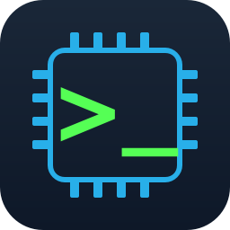
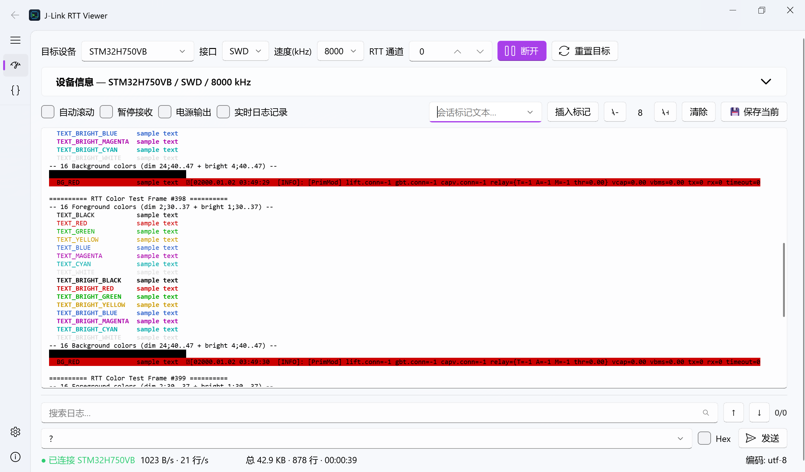
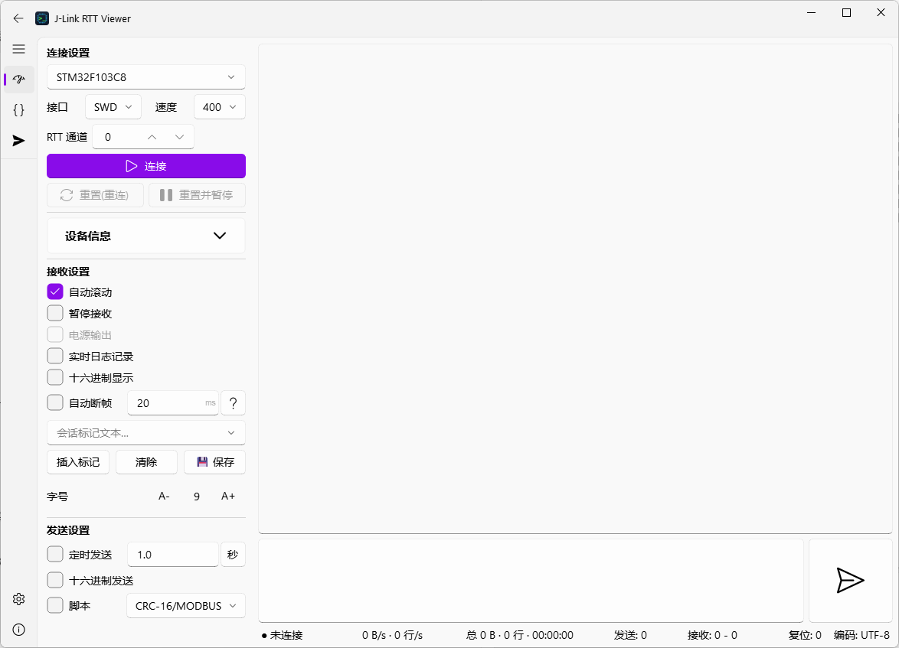
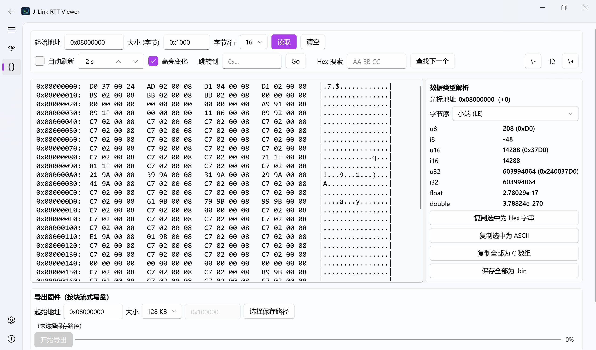
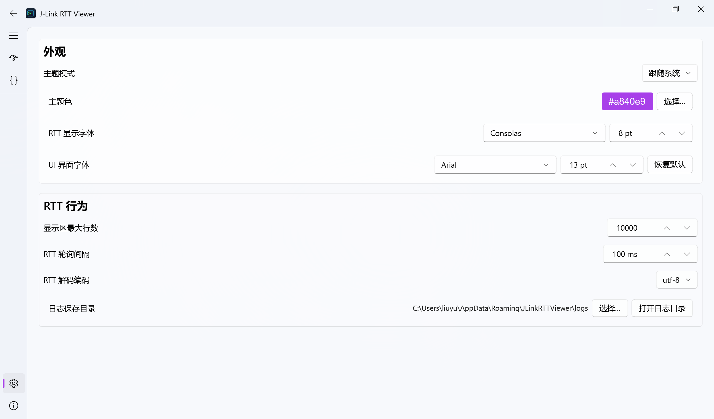
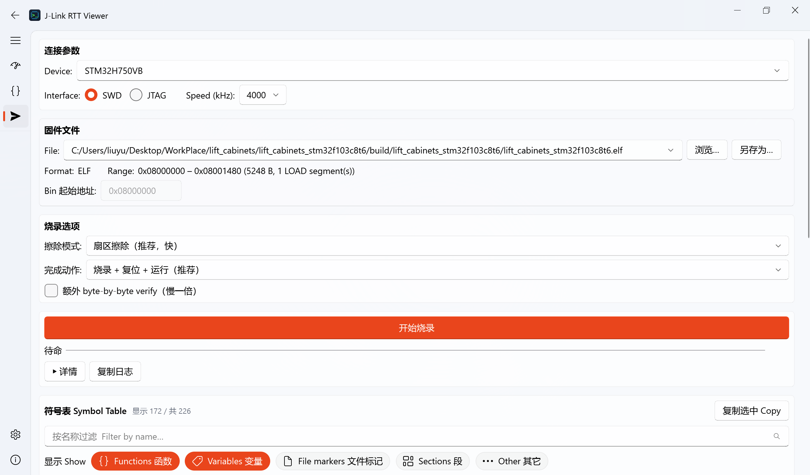
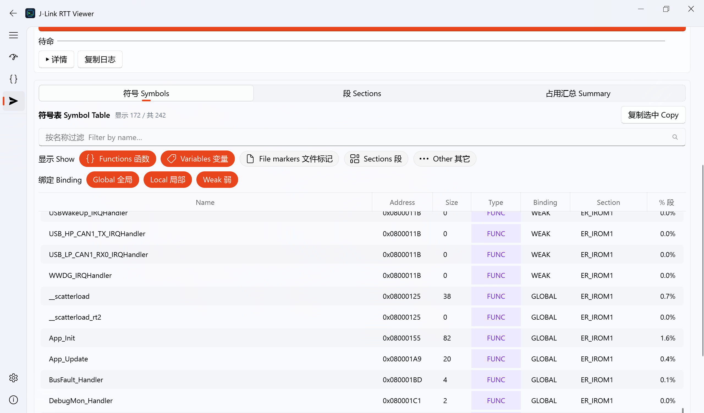

<p align="center">
  
</p>

# J-Link RTT Viewer (PyQt)

> Fluent 风格的 SEGGER J-Link RTT 实时查看 + MCU 内存读写 + 固件烧录工具，PySide6 + qfluentwidgets 重写版，Nuitka 打包成单文件 / standalone 目录两种 Windows 可执行。

[](https://github.com/MisakaMikoto128/j-link-rtt-viewer-pyqt/actions/workflows/test.yml)
[](LICENSE)
[](https://www.python.org/)
[](https://github.com/Square/pylink)

| 旧版主页 | 新版主页（v0.7.0） |
|:---:|:---:|
|  |  |

## ✨ 功能

- 🌐 **多语言界面** — 简体中文 / 繁體中文 / 日本語 / 한국어 / English / Français 即时切换
- 🚀 **实时 RTT 监控** — UTF-8 / GBK / UTF-16-LE / Latin-1 / ASCII 解码，ANSI 颜色着色，0-15 通道任意切换（或 -1=全部通道），文本 / 十六进制回发数据，最近 50 条发送历史
- 🔍 **搜索 / 替换浮动栏** — Ctrl+F 查找 / Ctrl+H 替换，支持正则 / 全词 / 大小写，匹配高亮 + 染色替换，VSCode 风格交互
- 🔢 **HEX 显示 / 发送** — 接收区一键切十六进制查看，发送区支持 HEX 模式双向切换，发送历史自动记录
- ⏱️ **定时发送** — 按间隔自动重复发送，支持文本 / HEX 两种模式
- 🧮 **CRC 发送脚本** — 内置 CRC-8 / CRC-16 / CRC-32 算法，发送时自动追加校验值，可开关
- 📏 **自动断帧** — 按空闲间隙自动插入换行，无需 MCU 端配合即可分行显示
- 💾 **固件烧录** — 支持 `.axf` / `.elf` / `.hex` / `.bin`，浏览 / 拖放 / 最近文件三种选法，独立烧录器（J-Link / ST-Link / CMSIS-DAP / DAPLink，前者走 pylink、后三者走 pyOCD），独立 worker（不干涉 RTT 会话），可选擦除模式与完成动作，可选逐字节校验，详情日志一键复制（[指南](docs/flashing-guide.md)）
- 👀 **固件变化自动烧录** — `QFileSystemWatcher` 监听选中固件 mtime 变化（系统级文件事件，非轮询），编译器原子替换会触发橙色提示，可选「固件变化后自动烧录」RadioButton 一键启用；防抖 1s 复查防「删旧建新」让 watcher 失效
- 🔁 **固件格式转换** — 「另存为」一键把 axf/elf/hex/bin 转换为 `.bin` / `.hex`，离线可用，无需 J-Link
- 🔣 **固件分析视图** — 选中 axf/elf 时烧录页底部出现分段面板：**符号**（名称搜索、地址/大小数值排序、类别 + 绑定 chip 多选过滤、彩色 Type pill、复制选中、% 段列）、**段**（SHF_ALLOC 段地址 / 大小 / RWX / 对齐）、**占用汇总**（Berkeley 统计 text/data/bss + Flash/RAM 总量 + Entry point / 初始 SP / Reset_Handler）（[指南](docs/symbol-table-guide.md)）
- 📦 **CMSIS-Pack 管理页** — Pack 存储目录配置（默认用户配置同级 `packs/`），已安装 pack 表格（文件名 / 厂商 / 版本 / 大小、子串过滤 + 删除），在线按 `part_number` 搜索 CMSIS-Pack 索引分页 12/页选中下载；延迟加载（首次 showEvent 才 import + 枚举），不阻塞 UI
- 🔍 **内存查看** — Hex dump（8/16/32 字节/行），地址跳转，hex pattern 搜索，自动刷新 + diff 高亮，hover 实时类型解析（u8-u64 / i8-i64 / float / double，小端/大端），固件按区间分块导出 `.bin`，写内存（带 confirm）
- 📐 **收窄模式悬浮面板** — 窗口缩窄时左侧配置面板自动转为悬浮卡片，ToolToggleButton 控制显隐，fade + slide 动画，不遮挡工具栏
- 🎨 **Fluent 设计** — 浅色 / 深色 / 跟随系统主题，主题色 + 界面字体（family/字号）+ RTT 字体可独立配置
- 🖼️ **可配置背景图片** — 设置页选背景图，透明度 0–100% 可调，拉伸 / 覆盖 / 居中 / 平铺四种填充方式，启用背景图自动让位 Mica
- 🎯 **多 J-Link 设备选择** — 顶部下拉自动枚举所有接入 J-Link（200ms 刷新），serial 持久化回选，离线红点指示，即插即用
- 🔗 **远程连接（Remote Server）** — 连接远端 J-Link Remote Server，IPv4 / 主机名均可（主机名由 Python 侧解析，规避 DLL 不做 DNS 的坑），2s TCP 可达性预检
- 📝 **会话标记** — 手动插入 + 连接/断开自动插入（颜色可配）
- ⌨️ **快捷键** — F2 连接 / F3 断开 / F4 重置 / Ctrl+F 查找 / Ctrl+H 替换（任意子页生效，幂等）
- 🔄 **可配置重置行为** — 正常重置 / 重置并暂停（halt）/ 自动重连（更可靠，1s 延迟）
- 📐 **可拖动 RTT display 高度** — 自定义 resize handle，超出窗口自动整页滚
- 💡 **屏幕常亮** — 长会话监控时防止系统息屏
- 📦 **Nuitka 双模式打包** — standalone 多文件目录（启动最快）与 onefile 单 exe（便携），多分辨率图标，开发/打包一致

## 📸 截图

| RTT 监控 | 内存查看 | 设置 |
|:---:|:---:|:---:|
|  |  |  |

| 固件烧录 | 固件分析（符号 / 段 / 占用汇总） |
|:---:|:---:|
|  |  |

## 🚀 快速开始

### 前置要求

- **SEGGER J-Link 驱动**（[官方下载](https://www.segger.com/downloads/jlink/)），`JLinkARM.dll` 由 pylink 自带；仅使用 ST-Link / CMSIS-DAP / DAPLink 烧录则不需要 J-Link 驱动
- 至少一个支持的调试器（J-Link BASE / EDU / PLUS 等，或 ST-Link / CMSIS-DAP / DAPLink）
- 从源码运行还需要 **Python 3.10+**；下载 Release 直接用则不需要

### 直接下载使用（推荐）

到 [Releases 页面](https://github.com/MisakaMikoto128/j-link-rtt-viewer-pyqt/releases) 下载，两种包二选一：

| 包名 | 适合 | 启动速度 | 体积 |
|---|---|---|---|
| `JLinkRTTViewer-vX.Y.Z-win64.zip` | 装到固定目录长期用 | 最快（无解压步骤，实测 1.63s） | ~44 MB（解压后 ~107 MB） |
| `JLinkRTTViewer-vX.Y.Z-win64.exe` | U 盘 / 临时使用 / 单文件分发 | 首次冷启 ~3.5-3.9s（解压到缓存），缓存命中后 ~1.96s | ~31 MB |

**使用步骤：**
1. zip 版：解压到任意目录后双击 `JLinkRTTViewer.exe`；onefile 版：直接双击 `.exe`
2. 在 UI 顶部选目标 MCU、接口（SWD / JTAG）、速度、RTT 通道 → 点「连接」
3. 用户偏好自动保存到 `%APPDATA%\JLinkRTTViewer\user_prefs.json`
4. 想加自己的 MCU / 改默认速度档？编辑 `%APPDATA%\JLinkRTTViewer\config.json`（首次启动自动从内置版 seed 一份）

> 不需要安装 Python，**目标机器只要装了 SEGGER J-Link 驱动就能跑**（仅使用 ST-Link / CMSIS-DAP / DAPLink 烧录时连 J-Link 驱动都不需要）。
> onefile 版首次启动会解压到 `%LOCALAPPDATA%\JLinkRTTViewer\Cache\<版本号>\`，删除该目录会触发下次启动重新解压。

更多用法见 [用户手册](docs/USER_GUIDE.md)。

### 从源码运行

依赖装法二选一——`pip`（默认主流程，事实标准）或 `uv`（可选的现代方式）。

**A. pip（默认）**

```bash
# 1. 克隆
git clone https://github.com/MisakaMikoto128/j-link-rtt-viewer-pyqt.git
cd j-link-rtt-viewer-pyqt

# 2. 创建虚拟环境
python -m venv venv
venv\Scripts\activate.bat

# 3. 安装依赖（pylink-square 锁定 1.6.0，详见下方）
pip install -r requirements.txt

# 4. 启动
python src/main.py
# 或直接双击 start.bat
```

**B. uv（可选）**

```bash
git clone https://github.com/MisakaMikoto128/j-link-rtt-viewer-pyqt.git
cd j-link-rtt-viewer-pyqt
uv sync                                  # 按 pyproject.toml + uv.lock 装齐
uv run python src/main.py                # 或 .venv\Scripts\activate.bat 后 python src/main.py
```

> 仓库已有 `uv.lock`；`uv sync` 按 `pyproject.toml` + 锁文件装齐与 `requirements.txt` 等价的依赖集。两种方式择一即可，别混用。

### 打包

两个 bat 二选一（均**不需要目标机器装 Python**）：

```bash
build_nuitka.bat            # standalone：输出 build\main.dist\，启动最快（实测 1.63s 中位数）
build_nuitka_onefile.bat    # onefile：输出 build\onefile\JLinkRTTViewer.exe，单文件便携
```

打 Release 资产（编译完成后）：

```powershell
./scripts/package_release.ps1 -Mode both
# 产物：
#   build/JLinkRTTViewer-vX.Y.Z-win64.zip  （standalone 压缩包）
#   build/JLinkRTTViewer-vX.Y.Z-win64.exe  （重命名后的 onefile）
```

**一键发版**（版本 bump → 提交 → tag → 双版本编译 → 打包 → push → 建 GitHub Release）：

```powershell
# 交互菜单选「Release to GitHub」，或直接：
./scripts/package_release.ps1  # 进入菜单后选第 3 项
# 可选：-DryRun 预演（不提交不编译不发版）
```

详细打包参数、构建速度、可选排除项与构建零 WARNING 的清理记录见 [docs/packaging_startup_report.md](docs/packaging_startup_report.md)。MSI 安装器另见 `installer/`（WiX 工程 `product.wxs` + `build_msi.bat`）。

## ⚡ 性能

启动时间实测（Nuitka 4.1 + PySide6 + qfluentwidgets，2026-07 采样，`scripts/measure_launch.py` warmup 1 + 5 次取中位数）：

| 方案 | 启动时间 |
|---|---|
| 直接跑 `python src/main.py` | 2.00s |
| standalone（`build_nuitka.bat`） | 1.63s |
| onefile 冷启动（无缓存） | 3.5~3.9s |
| onefile 缓存命中 | ~1.96s |

standalone 已比直接 Python 快——启动瓶颈是 PySide6 / qfluentwidgets / pylink 的 import 本身（合计 ~470ms 硬开销），不在打包形态。完整实测表、第二轮优化与 PyInstaller / cx_Freeze / PyOxidizer 对比分析见 [docs/packaging_startup_report.md](docs/packaging_startup_report.md)。

## 📖 文档

- **用户手册**：[docs/USER_GUIDE.md](docs/USER_GUIDE.md) — 完整 UI / 配置 / 快捷键说明
- **固件烧录指南**：[docs/flashing-guide.md](docs/flashing-guide.md) — 烧录流程 + 固件另存为（格式转换）
- **符号表 / 段 / 占用汇总指南**：[docs/symbol-table-guide.md](docs/symbol-table-guide.md) — chip 过滤 / 排序 / 复制 / 实用技巧
- **打包启动速度实测**：[docs/packaging_startup_report.md](docs/packaging_startup_report.md) — 打包选型、构建速度、onefile 缓存、替代打包方案对比
- **工程笔记**：[CLAUDE.md](CLAUDE.md) — 项目演进中遇到的真实 Qt / pylink / 打包 / 烧录器坑与解法索引
- **贡献指南**：[CONTRIBUTING.md](CONTRIBUTING.md)
- **更新日志**：[CHANGELOG.md](CHANGELOG.md)

## ⚠️ pylink-square 必须用 1.6.0

pylink-square 2.x 在 SEGGER J-Link DLL 下有 breaking change：`rtt_start` / `rtt_read` 内部行为变化，导致 RTT 通道永远没数据（虽然 `connected()` 返回 True）。本项目锁定 1.6.0，请**不要**升级。

详见 [CLAUDE.md](CLAUDE.md) 中相关条目。

## 🛠️ 技术栈

| 组件 | 版本 | 用途 |
|---|---|---|
| [PySide6](https://pypi.org/project/PySide6/) | ≥ 6.6, < 7 | Qt for Python |
| [PySide6-Fluent-Widgets](https://github.com/zhiyiYo/PyQt-Fluent-Widgets) | ≥ 1.6, < 2.0 | Fluent 设计组件库 |
| [pylink-square](https://github.com/Square/pylink) | **1.6.0**（锁版本） | SEGGER J-Link Python 封装（J-Link RTT + J-Link 烧录） |
| [pyOCD](https://github.com/pyocd/pyOCD) | ≥ 0.36 | ST-Link / CMSIS-DAP / DAPLink 烧录与 CMSIS-Pack 解析 |
| [pyelftools](https://github.com/eliben/pyelftools) | ≥ 0.29 | `.axf` / `.elf` 解析（符号表 / 段 / 占用汇总） |
| [intelhex](https://github.com/python-intelhex/intelhex) | ≥ 2.3.0 | `.hex` 解析与 bin/hex 格式转换 |
| [cmsis-pack-manager](https://github.com/pyocd/cmsis-pack-manager) | （pyOCD 传递依赖） | CMSIS-Pack 索引与下载 |
| [Nuitka](https://nuitka.net/) | ≥ 2.0 | Python → 原生 exe（实测用 4.1） |
| [pytest](https://docs.pytest.org/) | ≥ 8.0 | 测试（配 pytest-qt ≥ 4.4，`QT_QPA_PLATFORM=offscreen` CI 友好） |

## 🤝 贡献

欢迎 Issue / PR！请先看 [CONTRIBUTING.md](CONTRIBUTING.md)。

## 📄 License

[MIT](LICENSE) © 2026 [@MisakaMikoto128](https://github.com/MisakaMikoto128)

## 🙏 致谢

- [SEGGER](https://www.segger.com/) — J-Link 调试器 + RTT 协议
- [Square](https://github.com/Square/pylink) — pylink-square
- [zhiyiYo](https://github.com/zhiyiYo) — PyQt-Fluent-Widgets
- [pyOCD 团队](https://github.com/pyocd) — pyOCD + cmsis-pack-manager

### AI 辅助开发

本项目在开发过程中使用了以下 AI 模型辅助编码、设计与测试：

- [Qoder](https://qoder.com/) — 代码生成与重构
- CLM-5.2 — 代码生成与调试
- [小米 MiMo](https://github.com/XiaomiMiMo) — 代码生成与审查
- Hy3 — 代码生成与测试