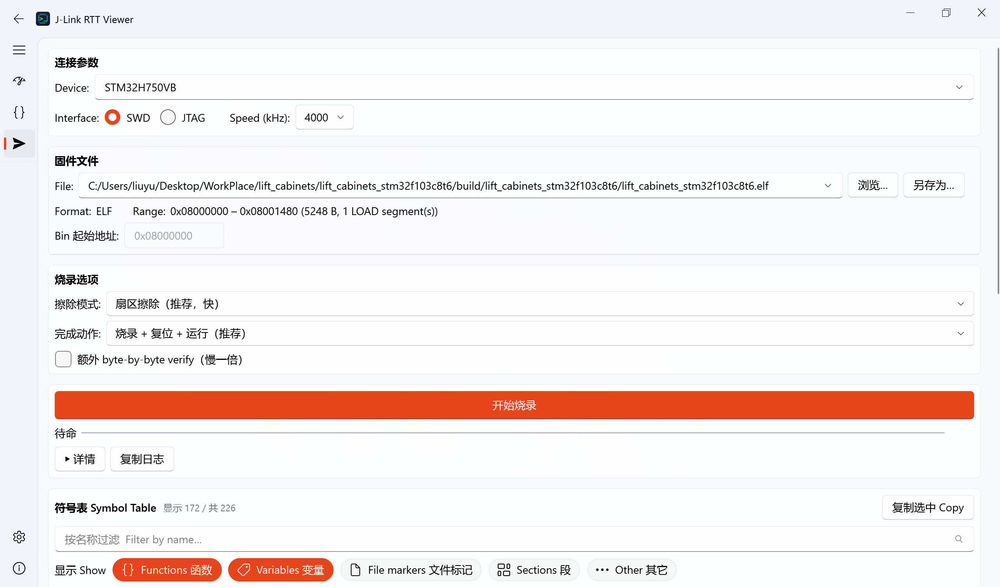

# 固件烧录页 — 使用指南

> 一个**完全独立**的固件烧录模块：独立的 `pylink` 会话 + 独立线程，和 RTT 监控 / 内存查看互不干扰。
> 支持 `.axf` / `.elf` / `.hex` / `.bin` 烧录到目标 MCU，并可把固件**另存为**其它格式。

---

## 1. 作用

把编译产物烧进 MCU 的片上 Flash，无需打开 Keil / STM32CubeProgrammer：

- 直接烧 `.axf` / `.elf`（带地址信息，免填起始地址）、`.hex`（带地址）、`.bin`（手填起始地址）。
- 一次操作完成「连接 → 擦除 → 写入 →（可选）校验 → 复位运行 → 断开」整条流水线。
- 失败时给出明确阶段和固定建议文案，方便定位。

> 烧录用的是一套**独立**的 J-Link 会话。它**不会**自动断开你在 RTT 监控页已建立的连接——是否断开由你自己决定（同一个 J-Link 同一时刻只能被一个会话占用，若 RTT 正连着同一设备，先在 RTT 页断开再烧录）。

---

## 2. 烧录流程

### 2.1 连接参数

| 项 | 说明 |
| --- | --- |
| **Device** | 目标芯片名（如 `STM32H750VB`）。下拉列表由当前选中的烧录器后端自动发现：J-Link 后端从 SEGGER J-Link DLL 枚举支持的 MCU；CMSIS-DAP / ST-Link 后端从 pyOCD 内置 target 与已安装 CMSIS-Pack 读取。也支持直接手动输入，后端会按各自命名约定做模糊匹配。 |
| **Interface** | `SWD`（推荐）或 `JTAG`。 |
| **Speed (kHz)** | 调试口速度，默认 `4000`。与 RTT 监控页一致的速度列表。 |

参数会自动持久化（`%APPDATA%\JLinkRTTViewer\user_prefs.json` 的 `flash_*` 键），下次打开沿用。

### 2.2 选择固件文件

三种方式，等价：

1. 点 **浏览…** 选文件；
2. 直接把固件文件**拖拽**到页面上；
3. 从 **File** 下拉里选**最近用过**的文件（最多保留 10 个）。

选中后立即解析并显示：

- **Format**：`ELF` / `HEX` / `BIN`；
- **Range**：起止地址 + 总字节数 + 备注（如 `1 LOAD segment(s)`）；
- **Bin 起始地址**：仅 `.bin` 可编辑（其它格式地址从文件读，输入框自动禁用）；
- 若文件在上次记录后被**重新编译过**（mtime 变化），File 右侧会显示 **● Updated** 提示，避免误烧旧固件。

### 2.3 烧录选项

| 选项 | 取值 | 建议 |
| --- | --- | --- |
| **擦除模式** | 扇区擦除 / 整片擦除 | 默认扇区擦除（快）；遇到烧录异常或想彻底清空时用整片擦除。 |
| **完成动作** | 仅烧录 / 烧录+复位 / 烧录+复位+运行 | 默认「烧录+复位+运行」，烧完直接跑。 |
| **额外 byte-by-byte verify** | 勾选框 | 逐字节回读校验，更稳但慢一倍。默认关闭（J-Link 已有 CRC 校验）。 |

### 2.4 开始烧录

点 **开始烧录**。期间：

- 进度条 + 阶段文字（连接中 / 擦除中 / 写入中 / 校验中 / 复位中）实时更新；
- 点 **▶ 详情** 展开日志面板（**失败时自动展开**）；
- **复制日志** 把日志连同 app / OS / pylink / PySide6 版本头复制到剪贴板，方便贴 issue。

---

## 3. 固件另存为（格式转换）

**浏览…** 按钮右侧的 **另存为…**，把当前选中的固件**转换并保存**为另一种格式。

- 目标格式由你在保存对话框里选的**后缀**决定：`.bin` 或 `.hex`。
- 支持的方向：
  - `.axf` / `.elf` → `.bin` / `.hex`（从 LOAD 段提取数据）
  - `.hex` → `.bin` / `.hex`
  - `.bin` → `.hex`（用页面上的「Bin 起始地址」定位）
- 注意：`.bin` / `.hex` **无法反向合成出 `.axf`（ELF）**，所以目标只提供 bin / hex。

**典型用途**：

- 把 Keil 产出的 `.axf` 转成量产烧录机用的 `.bin` / `.hex`；
- 把 `.hex` 转成纯 `.bin` 看实际大小 / 做差分；
- 转换不依赖 J-Link，离线即可用。

---

## 4. 常见问题

| 现象 | 处理 |
| --- | --- |
| 提示「未选择文件」 | 确认 File 框里有路径（浏览/拖放后应立即显示）。 |
| 连接失败 | 检查 Device 名是否正确、J-Link 是否被 RTT 页占用、接线与供电。 |
| 烧录中途失败 | 看详情日志的失败阶段；按提示改用「整片擦除」重烧。 |
| `.bin` 烧到错误地址 | `.bin` 不含地址，必须手填正确的「Bin 起始地址」（如 `0x08000000`）。 |

---

参见：[符号表查看器使用指南](symbol-table-guide.md)
